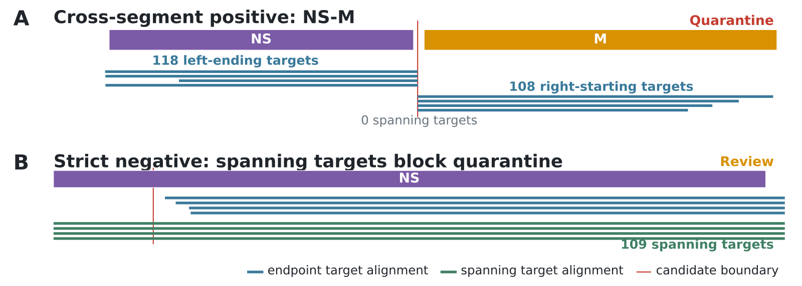

# VirAssQ

Check the structure of your viral contigs by reusing nucleotide alignments produced during clustering.

## Why?

We were hunting for segments of some RNA viruses when we noticed that some of the segments disappeared during clustering, specifically when tuning MMseqs2 to group fragments with longer contigs. This was important to overcome the multimapping problem. Upon closer investigation, it turned out that some of the contigs were chimeric or composite — combining two segments into one sequence. They also had a signature alignment profile — two stacks with a clear boundary. We decided to score other contigs to check if this pattern resurfaced and found that indeed it did! That's how this algorithm was born. It can be used to quickly screen your contig collection and quarantine suspicious contigs. We aimed to make it conservative to avoid quarantining real sequences.



Alignment stacks in a composite contig (top) and a continuous contig (bottom). A target alignment spanning the complete boundary window prevents quarantine.

## Run

Install from a local clone (Python 3.11 or later):

```bash
python -m pip install .
```

Provide selected representatives (FASTA or an ID list), MMseqs2 alignments and prepared contig annotations. See [input formats and outputs](docs/input_formats.md) for the required columns.

```bash
virassq screen \
  --representatives representatives.fasta \
  --alignments alignments.tsv \
  --annotations contig_best_hits.parquet \
  --output-directory virassq_output
```

Results include boundary tables, representative actions and a quarantine ID list. The output directory must be new or empty. This command reports decisions; it does not trim sequences or recluster the collection. Use `virassq screen --help` for options.
